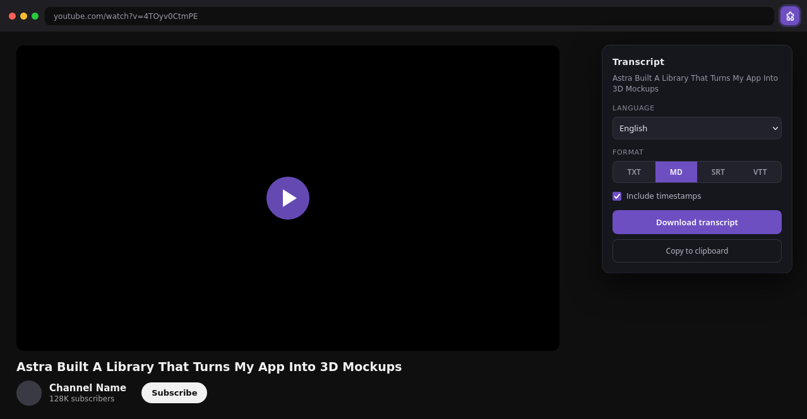
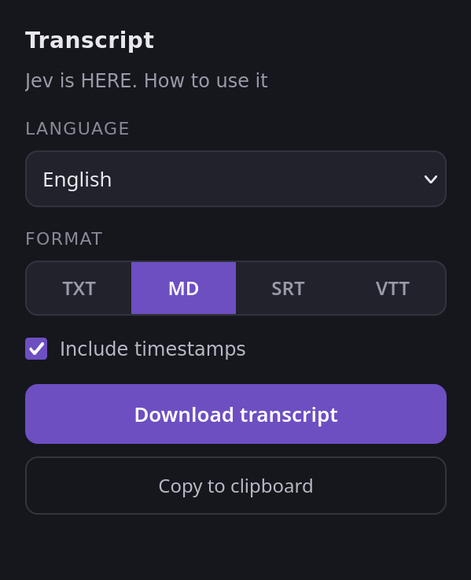

# Transcript Minimal

A minimalist Chrome extension that downloads YouTube captions in one click.
No popups, no ads, no accounts, no third-party servers, no clutter.

Pick a language, pick a format (**TXT**, **Markdown**, **SRT**, or **VTT**),
hit download — or copy the transcript straight to your clipboard.

Made for the agent era: one click turns any YouTube video into a clean,
timestamped transcript, ready to drop straight into Codex, Muse, or
whatever you're building with. Your agents will thank you.


## Screenshots



One click on any YouTube video: pick a language, pick a format, download or
copy. That's the whole UI:



## Features

- **One-click downloads** — open any YouTube video, click the extension icon, download.
- **Four formats** — TXT, Markdown, SRT, and VTT. SRT/VTT always carry timing;
  TXT/Markdown have an optional timestamps toggle.
- **Language picker** — lists every caption track YouTube serves for the video,
  preferring manual captions over auto-generated ones when both exist. Your
  pick becomes your preferred language: it sticks across videos, defaulting
  to your browser's language when you've never picked one.
- **Copy to clipboard** — paste the transcript anywhere without saving a file.
- **Remembers your preferences** — your chosen format, timestamp toggle, and
  preferred language are saved on your device (Markdown + timestamps by
  default). Change them any time in the popup; your choice sticks.
- **Smart fallback** — on videos where YouTube blocks the classic caption
  endpoint (common with auto-generated captions), the extension automatically
  retries through the same transcript API YouTube's own *"Show transcript"*
  panel uses. See [How it works](docs/HOW-IT-WORKS.md).
- **Private by design** — everything happens between your browser and YouTube.
  No analytics, no accounts, no external servers. See [Privacy](docs/PRIVACY.md).

## Install

The extension isn't on the Chrome Web Store (deliberately — see
[FAQ](#faq)). Install it unpacked in under a minute:

1. Download the [latest release](../../releases/latest) and unzip it
   (or `git clone` this repo).
2. Open `chrome://extensions` in Chrome.
3. Turn on **Developer mode** (top right).
4. Click **Load unpacked** and select the repo folder.
5. Open any YouTube video and click the extension icon.

> **Just installed and seeing an error?** Chrome only injects the helper into
> pages loaded *after* install — reload the YouTube tab once. Details in
> [Troubleshooting](docs/TROUBLESHOOTING.md).

Full walkthrough: [docs/INSTALL.md](docs/INSTALL.md).

## Automatic updates

Chrome never auto-updates an unpacked extension, but this repo ships both
halves of the next best thing:

1. **Scheduled pull (macOS).** A LaunchAgent runs `git pull` in your repo
   clone every 15 minutes:
   ```bash
   # 1. Edit the repo path inside the plist first:
   #    scripts/com.minimal-transcript.gitpull.plist
   cp scripts/com.minimal-transcript.gitpull.plist ~/Library/LaunchAgents/
   launchctl load ~/Library/LaunchAgents/com.minimal-transcript.gitpull.plist
   ```
2. **Self-reload.** The extension's background worker checks the repo's
   published `manifest.json` on browser startup and every 30 minutes. When
   the published version is newer than what's installed, it reloads itself
   so the pulled code takes effect.

This only works with a `git clone` install — a downloaded ZIP can't pull.
And one honest caveat: after installing *this* update, reload the extension
once in `chrome://extensions` (or restart Chrome). That's the last manual
reload; from then on the updater is running and handles the rest. Note that
already-open YouTube tabs keep the old helper until the tab is reloaded —
new code applies to pages loaded after the update.

Privacy note: the updater's only network call is fetching this repo's public
`manifest.json` from `raw.githubusercontent.com`. No user data, cookies, or
identifiers are sent. Details in [Privacy](docs/PRIVACY.md).

## Use

1. Pick a language (manual captions are preferred over auto-generated when
   both are available).
2. Pick a format: **TXT**, **MD**, **SRT**, or **VTT**.
3. Optionally include timestamps (TXT and Markdown only — SRT/VTT always
   carry timing).
4. **Download transcript** saves a file named like
   `Video Title.en.txt`, or use **Copy to clipboard** to paste it anywhere.

## How it works

A content script reads the video page's own player data (same-origin, using
your normal YouTube session) to find the caption tracks YouTube already
serves. The transcript is fetched directly from YouTube and formatted locally
in the popup — nothing ever leaves the round-trip between your browser and
YouTube.

When YouTube answers the classic caption endpoint with an empty body (it does
this on some videos, mostly auto-generated captions), the extension falls back
to the `youtubei/v1/get_transcript` endpoint with the page's own transcript
parameters — the exact request YouTube's *"Show transcript"* panel makes. And
when YouTube rejects even that (it increasingly wants attestation data only
its own player code can produce), the extension plays its last card: it
briefly drives YouTube's own *"Show transcript"* panel — expanding the
description, clicking *Show transcript*, scraping the segments, then closing
everything back up — so it works whenever YouTube's own panel works.

Deep dive: [docs/HOW-IT-WORKS.md](docs/HOW-IT-WORKS.md).

## Project layout

```
├── manifest.json      # Manifest V3, minimal permissions
├── content.js         # Tab helper: finds caption tracks, fetches transcripts
├── popup.html         # Popup markup
├── popup.css          # Popup styles
├── popup.js           # Popup logic: parsing, formatting, download, copy
├── icons/             # Extension icons (16/48/128)
├── docs/              # Install guide, architecture, privacy, troubleshooting
├── CHANGELOG.md       # Release history (Keep a Changelog format)
├── CONTRIBUTING.md    # How to contribute
└── AGENTS.md          # Instructions for AI agents working in this repo
```

## Permissions — and why each one is needed

| Permission | Why |
|---|---|
| `activeTab` | Read the current tab's URL/title when you click the icon. |
| `scripting` | Inject the content script if the extension was installed mid-session. |
| `alarms` | Wake the self-updater to check for a new published version (browser startup + every 30 minutes). |
| `storage` | Remember your format, timestamp, and language preferences on your device. Nothing else is stored. |
| Host `*://*.youtube.com/*` | Read the video page's player data and fetch captions (same-origin). |
| Host `https://raw.githubusercontent.com/*` | Fetch this repo's public `manifest.json` for the version check behind automatic updates. No user data is sent. |

That's the whole list. No `<all_urls>`, no cookies permission. The background
service worker's only network call is the public manifest check above.

## FAQ

**Why isn't this on the Chrome Web Store?**
Publishing there costs a developer fee, adds review delays, and invites
feature-creep pressure. Sideloading keeps it free, instant, and exactly this
minimal.

**Does it work on Shorts / embeds / age-restricted videos?**
Watch pages, Shorts, and embeds are supported. Age-restricted videos work if
you're signed in to an account that can play them — the extension uses your
normal YouTube session. One Shorts caveat: YouTube's Shorts player doesn't
offer the *"Show transcript"* panel, so on Shorts the last-resort panel
fallback can't run — the direct caption download (which is layout-independent)
is what carries Shorts, and it works whenever the Short has captions.

**A video has captions on YouTube but the extension says none are available.**
Some videos gate caption *downloads* while still showing captions in the
player. The extension tries both of YouTube's transcript paths; if both are
blocked, it tells you plainly instead of failing silently.

**Does it upload anything anywhere?**
No. See [docs/PRIVACY.md](docs/PRIVACY.md).

## About

Brought to you by [Brad Groux](https://twitter.com/bradgroux) and [Digital Meld](https://go.sstb.ai/extensions).

Learn to build tools like this in the [SSTB.ai community](https://go.sstb.ai/transcript-minimal).

## Changelog

See [CHANGELOG.md](CHANGELOG.md). Releases are cut from git tags
(`v1.0.0`, `v1.1.0`, …) — each with notes on the
[Releases](../../releases) page.

## Contributing

Bug reports and small, focused PRs are welcome. Please read
[CONTRIBUTING.md](CONTRIBUTING.md) first — the short version: keep it minimal,
keep it private-by-design, add a CHANGELOG entry.

## License

[MIT](LICENSE) — do whatever you want with it.
